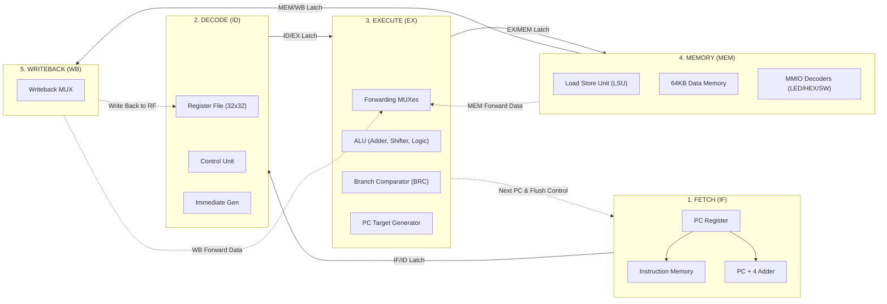

# 🚀 32-bit RISC-V 5-Stage Pipelined Processor (RV32I Core)

[](https://riscv.org/)
[]()
[]()
[-success.svg)]()
[](https://fee.hcmut.edu.vn/)

> **Đồ án môn học:** Kiến trúc Máy tính (COD) — EE3203 (Computer Organization and Design)  
> **Khoa:** Khoa Điện - Điện tử | **Bộ môn:** Bộ môn Điện tử — **Trường Đại học Bách Khoa - ĐHQG TP.HCM (HCMUT)**  
> **Milestone 3:** Thiết kế, hiện thực và kiểm thử bộ vi xử lý 32-bit RISC-V dạng Pipeline 5 tầng có Forwarding, Hazard Detection & I/O Peripherals.

---

## 📑 Mục lục
1. [Giới thiệu Tổng quan](#1-giới-thiệu-tổng-quan)
2. [Thông số Kỹ thuật (Hardware Specifications)](#2-thông-số-kỹ-thuật-hardware-specifications)
3. [Điểm Nổi Bật & Đột Phá Kiến Trúc (Key Highlights)](#3-điểm-nổi-bật--đột-phá-kiến-trúc-key-highlights)
4. [Kiến trúc Pipeline 5 Tầng (Datapath Architecture)](#4-kiến-trúc-pipeline-5-tầng-datapath-architecture)
5. [Chiến lược Xử lý Hazard & Chuyển luồng](#5-chiến-lược-xử-lý-hazard--chuyển-luồng)
6. [Bản đồ Bộ nhớ & Ngoại vi (Memory-Mapped I/O)](#6-bản-đồ-bộ-nhớ--ngoại-vi-memory-mapped-io)
7. [Cấu trúc Thư mục Dự án](#7-cấu-trúc-thư-mục-dự-án)
8. [Kết quả Kiểm thử & Đánh giá Hiệu năng (Benchmark)](#8-kết-quả-kiểm-thử--đánh-giá-hiệu-năng-benchmark)
9. [Hướng dẫn Biên dịch & Mô phỏng (Quick Start)](#9-hướng-dẫn-biên-dịch--mô-phỏng-quick-start)

---

## 1. Giới thiệu Tổng quan

Dự án hiện thực một vi xử lý chuẩn **RISC-V 32-bit (RV32I)** dạng **5-stage pipeline** hoàn chỉnh bằng **SystemVerilog**, mô phỏng và kiểm tra trên nền tảng **ModelSim**. Bộ xử lý được trang bị đầy đủ các đơn vị chức năng nâng cao:
- **Đường truyền dữ liệu (Datapath) 5 tầng:** Fetch (IF) $\rightarrow$ Decode (ID) $\rightarrow$ Execute (EX) $\rightarrow$ Memory (MEM) $\rightarrow$ Writeback (WB).
- **Bộ Forwarding & Hazard Unit linh hoạt:** Triệt tiêu độ trễ xung đột dữ liệu (RAW data hazard), xử lý chuẩn xác Load-Use Hazard và Control Hazard (Branch/Jump).
- **Hỗ trợ ngoại vi Memory-Mapped I/O:** Giao tiếp trực tiếp với Switches, LEDs, màn hình LCD và 8 LED 7 đoạn (HEX0-HEX7).
- **Hỗ trợ truy xuất bộ nhớ lệch byte (Misaligned Access):** Cho phép các lệnh Load/Store đọc/ghi dữ liệu ở bất kỳ địa chỉ nào mà không bị gián đoạn.

---

## 2. Thông số Kỹ thuật (Hardware Specifications)

| Thông số | Đặc tả phần cứng |
| :--- | :--- |
| **Kiến trúc tập lệnh (ISA)** | RV32I Base Integer Instruction Set (37 lệnh chuẩn + mở rộng) |
| **Độ rộng từ dữ liệu / Địa chỉ**| 32-bit dữ liệu, 32-bit địa chỉ |
| **Tập thanh ghi (Register File)** | 32 thanh ghi 32-bit (`x0` - `x31`), thanh ghi `x0` cố định bằng `0` |
| **Tần số xung clock & Kích hoạt**| Đồng bộ sườn dương (`posedge i_clk`), RegFile ghi tại `negedge i_clk` |
| **Tín hiệu Reset** | Active-Low (`i_reset = 0` khởi động lại hệ thống) |
| **Bộ nhớ lệnh (Instruction Memory)** | 16K x 32-bit (ROM nạp file hex `.dump`) |
| **Bộ nhớ dữ liệu (Data Memory)**| 64 KiB SRAM nội bộ + Vùng giải mã ngoại vi (MMIO) |
| **Đơn vị số học logic (ALU)** | 32-bit Adder/Subtractor cấu trúc phân tầng (`adder_32bit`, `full_adder`), Barrel Shifter, Logical & Comparison units |

### Danh sách các tập lệnh hỗ trợ:
- **R-type (10 lệnh):** `ADD`, `SUB`, `SLL`, `SLT`, `SLTU`, `XOR`, `SRL`, `SRA`, `OR`, `AND`.
- **I-type Tính toán (9 lệnh):** `ADDI`, `SLTI`, `SLTIU`, `XORI`, `ORI`, `ANDI`, `SLLI`, `SRLI`, `SRAI`.
- **I-type Tải bộ nhớ (5 lệnh):** `LB`, `LH`, `LW`, `LBU`, `LHU` (hỗ trợ cả aligned và misaligned).
- **S-type Lưu bộ nhớ (3 lệnh):** `SB`, `SH`, `SW` (tích hợp byte-mask enable).
- **B-type Rẽ nhánh (6 lệnh):** `BEQ`, `BNE`, `BLT`, `BGE`, `BLTU`, `BGEU`.
- **J-type / I-type Nhảy (2 lệnh):** `JAL`, `JALR` (xóa LSB `& ~32'b1` chuẩn RISC-V).
- **U-type Hằng số lớn (2 lệnh):** `LUI`, `AUIPC`.

---

## 3. Điểm Nổi Bật & Đột Phá Kiến Trúc (Key Highlights)

Khác với các thiết kế mẫu cơ bản thường gặp phải nhiều xung đột và hạn chế về tính năng, project này sở hữu **5 cải tiến nổi bật**:

### 🌟 1. Tối ưu hóa Bộ so sánh nhánh (BRC) tại tầng EX & Triệt tiêu Stall
- **Vấn đề thường gặp:** Đặt BRC tại tầng ID để giảm penalty nhưng lại gây ra rất nhiều chu kỳ stall khi dữ liệu so sánh phụ thuộc vào kết quả của lệnh phía trước (chưa kịp ghi vào thanh ghi).
- **Giải pháp của project:** Đặt khối `brc` tại tầng **EX**, so sánh trực tiếp trên dữ liệu đã được **Forwarding từ tầng MEM và WB**.
- **Kết quả:** Triệt tiêu hoàn toàn **Branch Stall** và **JALR Stall**, giúp đường ống hoạt động mượt mà, IPC đạt mức tối ưu.

### 🌟 2. Giải pháp Đột phá cho Misaligned Memory Access (`malgn`)
- **Đặc điểm:** Phần lớn các bộ xử lý sinh viên chỉ hỗ trợ đọc dữ liệu chẵn 4-byte (aligned). Khi gặp địa chỉ lẻ (ví dụ `0x0001`, `0x0002`), dữ liệu bị sai lệch.
- **Giải pháp của project:** Trong module `lsu.sv`, áp dụng **kỹ thuật cửa sổ trượt 64-bit**:
  $$\text{raw\_mem\_64} = \{\text{data\_mem}[\text{word\_addr}+1], \text{data\_mem}[\text{word\_addr}]\}$$
  Dữ liệu 32-bit mong muốn được trích xuất chính xác theo offset byte:
  $$\text{mem\_rdata\_aligned} = \text{raw\_mem\_64}[\text{addr}[1:0] \times 8 +: 32]$$
- **Kết quả:** Vượt qua bài kiểm tra khó nhất **`malgn` test** với kết quả tuyệt đối.

### 🌟 3. Forwarding Unit Toàn diện & Thông minh
- Hỗ trợ chuyển tiếp dữ liệu đồng thời từ cả **MEM Stage** (kết quả ALU hoặc PC+4) và **WB Stage** (kết quả cuối cùng) về 2 toán hạng $A$ và $B$ của ALU & BRC tại tầng EX.
- Các lệnh phụ thuộc dữ liệu liên tiếp (như `add x1, x2, x3` theo sau ngay bởi `sub x4, x1, x5`) **chạy liên tục với 0 chu kỳ stall**.

### 🌟 4. Ghi thanh ghi 2 pha (Negative-Edge Clocked RegFile)
- Thanh ghi được đọc tổ hợp (`always_comb`) và ghi dữ liệu tại sườn âm xung clock (`negedge i_clk`).
- Cho phép dữ liệu ghi từ tầng WB hoàn tất ngay giữa chu kỳ clock, đảm bảo tầng ID đọc được dữ liệu mới nhất ở sườn dương tiếp theo mà không cần thêm mạch bypass nội tại trong Register File.

### 🌟 5. Tự động hóa Mô phỏng với 1 Câu lệnh (`run_sim.bat`)
- Tích hợp sẵn bộ script chạy batch thông minh:
  - `.\03_sim\run_sim.bat`: Chạy nhanh ở chế độ Command Line, in kết quả 39 bài test và thống kê IPC trong vài giây.
  - `.\03_sim\run_sim.bat gui`: Mở ngay giao diện trực quan ModelSim Waveform đã nạp sẵn toàn bộ tín hiệu các tầng IF, ID, EX, MEM, WB để debug.

---


### 🌟 6. Tích hợp Bộ Dự đoán Nhánh Động Nâng Cao (Dynamic Branch Predictor: BTB + BHT + RAS)
Trong phiên bản nâng cấp (milestone_3_test3), vi xử lý được trang bị thêm bộ dự đoán nhánh động **ranch_predictor.sv** ngay tại tầng nạp lệnh Fetch (IF):
- **Branch Target Buffer (BTB - 256 entries):** Lưu vết địa chỉ đích (Target Address) của các lệnh nhảy, cho phép nạp lệnh tại địa chỉ rẽ nhánh ngay trong chu kỳ tiếp theo mà không cần chờ tính toán ở tầng Execute.
- **Branch History Table (BHT - 2-bit Saturating Counter):** Máy trạng thái 4 mức thích nghi (*Strongly Not-Taken, Weakly Not-Taken, Weakly Taken, Strongly Taken*) học lịch sử rẽ nhánh để dự đoán hướng rẽ cực kỳ chuẩn xác.
- **Return Address Stack (RAS - 8 entries):** Dự đoán tức thì địa chỉ trở về cho các hàm con (call / ret qua JAL/JALR với thanh ghi liên kết 
a = x1/x5).
- **Hiệu năng đột phá so với bản gốc:**
  - **Số chu kỳ thực thi:** Giảm mạnh từ **7,830 cycles** xuống còn **6,358 cycles** (tiết kiệm gần **1,500 chu kỳ clock**).
  - **Tỉ lệ dự đoán sai (Misprediction Rate):** Giảm hơn một nửa, từ **90.45%** xuống chỉ còn **44.51%**.
  - **Hiệu suất xử lý (IPC):** Tăng vọt từ **0.62** lên **0.76** (tăng trưởng **~23% hiệu năng tổng thể**).

---

## 4. Kiến trúc Pipeline 5 Tầng (Datapath Architecture)



### Chi tiết các tầng:
1. **Instruction Fetch (IF):** 
   - `PC` lưu địa chỉ lệnh hiện tại.
   - `pc_plus_four` cộng địa chỉ thêm 4 byte ($PC + 4$).
   - `pc_target` chọn giữa $PC+4$ hoặc Target Address từ EX khi có Branch/Jump.
2. **Instruction Decode (ID):**
   - Trích xuất trường thanh ghi `rs1`, `rs2`, `rd`, `opcode`, `funct3`.
   - `immgen` giải mã số tức thời cho 6 định dạng (I, S, B, U, J).
   - `control_unit` tạo ra toàn bộ bus tín hiệu điều khiển.
3. **Execute (EX):**
   - MUX Forwarding chọn giữa dữ liệu gốc từ ID, kết quả từ MEM hoặc kết quả từ WB.
   - `alu` thực thi phép tính số học, logic hoặc dịch bit.
   - `brc` đánh giá điều kiện rẽ nhánh (`br_less`, `br_equal`).
4. **Memory Access (MEM):**
   - `lsu` quản lý đọc/ghi bộ nhớ RAM và các thanh ghi ngoại vi I/O.
   - Hỗ trợ lưu trữ theo kích thước byte, halfword, word thông qua `store_unit_logic`.
5. **Write Back (WB):**
   - `mux4` chọn dữ liệu ghi lại vào Register File: $PC+4$ (lệnh nhảy), kết quả ALU, hoặc dữ liệu đọc từ bộ nhớ (`ld_data`).

---

## 5. Chiến lược Xử lý Hazard & Chuyển luồng

Khối `hazard_forwarding.sv` chịu trách nhiệm phân tích và xử lý mọi xung đột:

| Loại Hazard | Tình huống xảy ra | Giải pháp xử lý | Penalty |
| :--- | :--- | :--- | :---: |
| **Data Hazard (RAW)** | Lệnh sau dùng thanh ghi của lệnh trước (R/I type). | Forwarding trực tiếp từ MEM/WB vào EX. | **0 cycle** |
| **Load-Use Hazard** | Lệnh ở EX là Load (`LW`), lệnh ở ID cần dùng ngay kết quả. | Stall PC, Stall IF/ID, chèn 1 NOP bubble vào EX. Sau đó forward dữ liệu từ WB sang EX. | **1 cycle** |
| **Control Hazard** | Rẽ nhánh thành công (`Branch Taken`) hoặc lệnh nhảy (`JAL`, `JALR`). | Tính toán đích nhảy tại EX, Flush 2 lệnh đã nạp sai ở IF/ID và ID/EX (`pc_sel_ex = 1`). | **2 cycles** |

---

## 6. Bản đồ Bộ nhớ & Ngoại vi (Memory-Mapped I/O)

Địa chỉ bộ nhớ được ánh xạ rõ ràng và an toàn:

| Vùng địa chỉ (Address Range) | Thiết bị / Mục đích | Quyền hạn |
| :--- | :--- | :---: |
| `0x0000_0000` - `0x0000_FFFF` | **Data Memory (SRAM 64 KiB)** | Read / Write |
| `0x1000_0000` - `0x1000_0003` | **Red LEDs (`o_io_ledr`)** (32 LED đỏ) | Write |
| `0x1000_1000` - `0x1000_1003` | **Green LEDs (`o_io_ledg`)** (32 LED xanh) | Write |
| `0x1000_2000` - `0x1000_2003` | **7-Segment Display (HEX0 - HEX3)** | Write |
| `0x1000_3000` - `0x1000_3003` | **7-Segment Display (HEX4 - HEX7)** | Write |
| `0x1000_4000` - `0x1000_4003` | **LCD Control/Data Register (`o_io_lcd`)** | Write |
| `0x1001_0000` - `0x1001_0003` | **Slide Switches (`i_io_sw`)** (32 Switches) | Read |

---

## 7. Cấu trúc Thư mục Dự án

```text
milestone_3_test/
├── 00_src/                     # Mã nguồn thiết kế phần cứng (SystemVerilog)
│   ├── pipelined.sv            # Top-level module kết nối 5 tầng pipeline
│   ├── hazard_forwarding.sv    # Đơn vị kiểm soát Hazard & Forwarding
│   ├── control_unit.sv         # Khối giải mã lệnh & tạo tín hiệu điều khiển
│   ├── alu.sv                  # Đơn vị số học logic (ALU)
│   ├── adder_32bit.sv          # Bộ cộng 32-bit phân tầng
│   ├── full_adder.sv           # Bộ cộng toàn phần 1-bit
│   ├── barrel_shifter.sv       # Bộ dịch bit đa năng (SLL, SRL, SRA)
│   ├── brc.sv                  # Bộ so sánh rẽ nhánh (Branch Comparator)
│   ├── comparator.sv           # Bộ so sánh độ lớn số học
│   ├── regfile.sv              # Tập thanh ghi 32x32-bit (Dual-edge)
│   ├── immgen.sv               # Bộ giải mã và mở rộng dấu tức thời
│   ├── lsu.sv                  # Đơn vị truy xuất bộ nhớ và ngoại vi (LSU)
│   ├── load_unit_logic.sv      # Xử lý cắt gọt dữ liệu đọc (LB, LH, LW...)
│   ├── store_unit_logic.sv     # Xử lý mask ghi byte bộ nhớ (SB, SH, SW...)
│   ├── PC.sv                   # Thanh ghi Program Counter
│   ├── pc_plus_four.sv         # Bộ tính PC + 4
│   ├── pc_target.sv            # Bộ tính địa chỉ đích nhảy (Branch/JAL/JALR)
│   ├── Imem.sv                 # Bộ nhớ nạp lệnh (ROM)
│   ├── mux4.sv                 # MUX 4 ngõ vào 32-bit
│   └── ...
├── 01_bench/                   # Môi trường kiểm thử (Testbench Verification)
│   ├── tbench.sv               # Top testbench kết nối DUT
│   ├── scoreboard.sv           # Khối theo dõi, chấm điểm và tính IPC
│   ├── driver.sv               # Khối kích thích tín hiệu đầu vào
│   └── tlib.svh                # Thư viện hàm kiểm thử
├── 02_test/                    # Tập tin mã máy kiểm thử (ISA Test Dumps)
│   ├── imem.dump               # File mã máy chương trình kiểm thử
│   └── dmem.dump               # Dữ liệu khởi tạo ban đầu cho RAM
├── 03_sim/                     # Thư mục làm việc mô phỏng của ModelSim
│   ├── run_sim.bat             # Script chạy nhanh 1 chạm (Hỗ trợ CLI & GUI)
│   ├── sim.do                  # Script mô phỏng CLI
│   └── gui.do                  # Script mở sóng dạng Waveform
├── run_sim.bat                 # Script chạy mô phỏng nhanh từ thư mục gốc
└── README.md                   # Tài liệu hướng dẫn và giới thiệu dự án
```

---


## 8. Kết quả Kiểm thử & Đánh giá Hiệu năng (Benchmark)

Bộ xử lý đã được kiểm thử toàn diện thông qua bộ testbench chính thức của môn học, bao quát toàn bộ 39 trường hợp kiểm thử lệnh đơn và chuỗi lệnh phức tạp:

### Bảng so sánh hiệu năng giữa Bản Cơ sở và Bản Nâng cao:
| Tiêu chí Đánh giá (Metrics) | Bản Pipeline Cơ sở (milestone_3_test) | Bản Tích hợp Branch Predictor (milestone_3_test3) | Cải thiện (%) |
| :--- | :---: | :---: | :---: |
| **Số bài test ISA vượt qua** | **39 / 39 (100% PASS)** | **39 / 39 (100% PASS)** | Hoàn hảo |
| **Tổng số lệnh thực thi** | 4,825 | 4,825 | Chuẩn xác |
| **Tổng chu kỳ clock (Cycles)** | **7,830** | **6,358** | **Giảm 18.8% chu kỳ** |
| **Số lần rẽ nhánh đoán sai** | 1,449 | **713** | **Giảm 50.8% lỗi rẽ nhánh** |
| **Tỉ lệ đoán sai (Mispred Rate)**| 90.45 % | **44.51 %** | **Giảm hơn một nửa** |
| **Instructions Per Cycle (IPC)**| **0.62** | **0.76** | **Tăng trưởng +22.6%** |

`	ext
===================================================
Kết quả kiểm thử thực tế trên ModelSim (CLI Mode):
===================================================
PIPELINE - ISA tests:
add......PASS   addi.....PASS   sub......PASS   and......PASS   andi.....PASS
or.......PASS   ori......PASS   xor......PASS   xori.....PASS   slt......PASS
slti.....PASS   sltu.....PASS   sltiu....PASS   sll......PASS   slli.....PASS
srl......PASS   srli.....PASS   sra......PASS   srai.....PASS   lw.......PASS
lh.......PASS   lhu......PASS   lb.......PASS   lbu......PASS   sw.......PASS
sh.......PASS   sb.......PASS   auipc....PASS   lui......PASS   beq......PASS
bne......PASS   blt......PASS   bltu.....PASS   bge......PASS   bgeu.....PASS
jal......PASS   jalr.....PASS   malgn....PASS   iosw.....PASS

END of ISA tests: 39 / 39 PASSED (100%)
`

---

## 9. Hướng dẫn Biên dịch & Mô phỏng (Quick Start)

### Yêu cầu hệ thống:
- Hệ điều hành: Windows 10/11.
- Phần mềm: **ModelSim** (Altera Starter Edition 10.1d hoặc mới hơn). Đảm bảo `vsim` đã được thêm vào biến môi trường `PATH`.

### Cách thực hiện:

#### 1. Chạy kiểm thử tự động (Command Line Interface - Nhanh nhất):
Mở terminal (PowerShell hoặc Command Prompt) tại thư mục gốc của project và gõ:
```powershell
.\run_sim.bat
```
*(hoặc `.\03_sim\run_sim.bat`)*  
*Kết quả các bài test PASS sẽ hiển thị trực tiếp trên màn hình console.*

#### 2. Mở giao diện sóng đồ họa (ModelSim GUI Mode):
Để phân tích dạng sóng (Waveform), timing và chuyển dịch dữ liệu qua các tầng pipeline:
```powershell
.\run_sim.bat gui
```
*(hoặc `.\03_sim\run_sim.bat gui`)*  
*ModelSim sẽ tự động mở lên, cấu hình sẵn cấu trúc tín hiệu các tầng IF, ID, EX, MEM, WB và chạy đến điểm dừng hoàn tất.*

---

## 👥 Tác giả & Đóng góp
Dự án được thực hiện bởi nhóm sinh viên **Trường Đại học Bách Khoa - ĐHQG TP.HCM**:
- **Môn học:** Kiến trúc Máy tính (COD) — Mã môn: EE3203
- **Khoa & Bộ môn:** Bộ môn Điện tử — Khoa Điện - Điện tử
- **Nhiệm vụ:** Hiện thực toàn bộ Datapath, Control Unit, Hazard Unit, LSU, Branch Predictor và tối ưu kiến trúc Pipeline RV32I.
