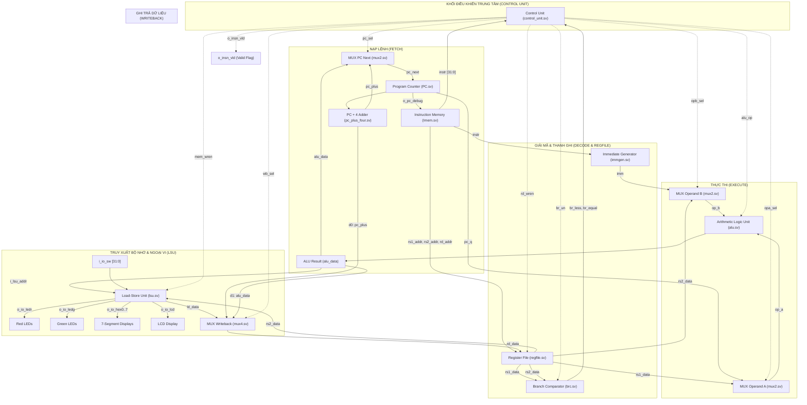

# 🚀 32-bit RISC-V Single-Cycle Processor (RV32I Core)

[](https://riscv.org/)
[]()
[-blueviolet.svg)]()
[]()
[]()
[-0078D7.svg)]()
[-success.svg)]()
[](https://dee.hcmut.edu.vn/)

> **Đồ án môn học:** Kiến trúc Máy tính (EE3203)  
> **Khoa Điện - Điện tử — Bộ môn Điện tử — Trường Đại học Bách Khoa - ĐHQG TP.HCM (HCMUT)**  
> **Milestone 2:** Thiết kế, hiện thực bằng SystemVerilog và kiểm thử bộ vi xử lý 32-bit RISC-V Chu kỳ đơn (Single-Cycle Core) với đầy đủ Memory-Mapped I/O, xử lý truy xuất bộ nhớ lệch (Misaligned Access) và Wrapper tổng hợp lên kit FPGA Altera DE2.

---

## 📑 Mục lục
1. [Giới thiệu Tổng quan](#1-giới-thiệu-tổng-quan)
2. [Thông số Kỹ thuật (Hardware Specifications)](#2-thông-số-kỹ-thuật-hardware-specifications)
3. [Kiến trúc Đường truyền Dữ liệu (Datapath Architecture)](#3-kiến-trúc-đường-truyền-dữ-liệu-datapath-architecture)
4. [Điểm Nổi Bật & Đột Phá Thiết Kế (Key Technical Highlights)](#4-điểm-nổi-bật--đột-phá-thiết-kế-key-technical-highlights)
5. [Bản đồ Bộ nhớ & Ngoại vi (Memory-Mapped I/O)](#5-bản-đồ-bộ-nhớ--ngoại-vi-memory-mapped-io)
6. [Cấu trúc Thư mục Dự án (Project Hierarchy)](#6-cấu-trúc-thư-mục-dự-án-project-hierarchy)
7. [Kết quả Kiểm thử (Verification Results)](#7-kết-quả-kiểm-thử-verification-results)
8. [Hướng dẫn Biên dịch & Mô phỏng (Quick Start)](#8-hướng-dẫn-biên-dịch--mô-phỏng-quick-start)
9. [Cấu hình Tổng hợp FPGA trên Kit DE2](#9-cấu-hình-tổng-hợp-fpga-trên-kit-de2)
10. [Tác giả & Đóng góp](#10-tác-giả--đóng-góp)

---

## 1. Giới thiệu Tổng quan

Dự án hiện thực trọn vẹn một vi xử lý chuẩn **RISC-V 32-bit (RV32I)** theo kiến trúc **Single-Cycle (Chu kỳ đơn)** bằng ngôn ngữ **SystemVerilog**, tuân thủ nghiêm ngặt các yêu cầu kỹ thuật của tài liệu đặc tả **Milestone 2 (Computer Architecture - HCMUT)**.

Khác với kiến trúc đa tầng (Pipelined), bộ xử lý Single-Cycle hoàn thành toàn bộ các giai đoạn của một lệnh bao gồm **Nạp lệnh (Instruction Fetch) $\rightarrow$ Giải mã (Decode) $\rightarrow$ Thực thi (Execute) $\rightarrow$ Truy xuất bộ nhớ (Memory Access) $\rightarrow$ Ghi trả (Writeback)** trong **đúng một chu kỳ xung clock duy nhất ($\text{CPI} = 1$)**.

### Các đặc điểm cốt lõi của thiết kế:
- **Đạt hiệu suất chuẩn $\text{CPI} = 1$:** Không phát sinh xung đột dữ liệu (Data Hazard) hay xung đột điều khiển (Control Hazard), không cần bộ đệm chuyển tiếp (Forwarding Unit) hay các chu kỳ tạm dừng (Stall cycles).
- **Mạch số học thuần phần cứng khả tổng hợp (Synthesizable RTL):** Không sử dụng các toán tử bị hạn chế trong đồ án như `+`, `-`, `*`, `/`, `<<`, `>>`, `<` trong ALU và BRC; thay vào đó tự thiết kế các module mức cổng và phân tầng (Ripple-Carry Adder 32-bit, Barrel Shifter, Structural Comparator).
- **Hỗ trợ toàn diện Memory-Mapped I/O (MMIO):** Giao tiếp trực tiếp với các thiết bị ngoại vi trên kit thực hành FPGA: 18 LED đỏ, 9 LED xanh, 8 bộ LED 7-đoạn (HEX0-HEX7), màn hình LCD và 18 Switch gạt.
- **Xử lý đột phá bộ nhớ lệch địa chỉ (Misaligned Memory Access):** Khắc phục hoàn toàn lỗi khi truy xuất dữ liệu nửa từ (Halfword) và từ đơn (Word) tại các địa chỉ không chia hết cho 2 hoặc 4, vượt qua bài test mở rộng `malgn` với kết quả **100% PASS**.
- **Tương thích hoàn hảo 2 nền tảng EDA:** Kiểm thử thành công trên cả **Mentor ModelSim** (môi trường Windows) và **Cadence Xcelium / SimVision** (môi trường máy chủ Linux Lab HCMUT).

---

## 2. Thông số Kỹ thuật (Hardware Specifications)

| Thông số | Đặc tả phần cứng | Ghi chú thiết kế |
| :--- | :--- | :--- |
| **Kiến trúc tập lệnh (ISA)** | RISC-V RV32I Base Integer Instruction Set | 37 lệnh chuẩn (trừ `FENCE`) + 2 bài test mở rộng |
| **Kiểu kiến trúc (Architecture)** | Single-Cycle (Chu kỳ đơn) | $\text{CPI} = 1$ cố định cho mọi chỉ thị |
| **Độ rộng đường truyền** | 32-bit Data / 32-bit Address | Chuẩn địa chỉ hóa theo từng byte |
| **Tập thanh ghi (Register File)** | 32 thanh ghi 32-bit (`x0` - `x31`) | Đọc tổ hợp bất đồng bộ, ghi đồng bộ tại sườn dương clock |
| **Thanh ghi `x0`** | Luôn ghim cứng mức logic `0` | Bất khả ghi (Hardwired zero) |
| **Xung clock & Reset** | `i_clk` (Posedge active), `i_reset` (Active-Low) | Sườn dương kích hoạt chốt PC và Regfile; Reset mức 0 |
| **Bộ nhớ lệnh (Instruction Memory)** | 16 KiB ROM bất đồng bộ | Nạp trước mã máy từ file hex thông qua `$readmemh` |
| **Bộ nhớ dữ liệu (Data Memory)** | 2 KiB - 64 KiB SRAM trong LSU | Đọc bất đồng bộ, ghi đồng bộ có Byte Masking |
| **Khối số học logic (ALU)** | 32-bit ALU đa chức năng | Thiết kế cấu trúc phân tầng: `adder_32bit`, `barrel_shifter` |
| **Khối so sánh nhánh (BRC)** | Branch Compare Unit chuyên biệt | Độc lập với ALU, hỗ trợ so sánh có dấu và không dấu |
| **Tín hiệu giám sát bắt buộc** | `o_pc_debug [31:0]`, `o_insn_vld` | Phục vụ Scoreboard chấm điểm tự động |

### Danh mục 37 tập lệnh RV32I được hỗ trợ:
1. **R-type (10 lệnh):** `ADD`, `SUB`, `SLL`, `SLT`, `SLTU`, `XOR`, `SRL`, `SRA`, `OR`, `AND`.
2. **I-type Tính toán (9 lệnh):** `ADDI`, `SLTI`, `SLTIU`, `XORI`, `ORI`, `ANDI`, `SLLI`, `SRLI`, `SRAI`.
3. **I-type Tải dữ liệu (5 lệnh):** `LB`, `LH`, `LW`, `LBU`, `LHU` (Hỗ trợ cả Aligned và Misaligned).
4. **S-type Lưu dữ liệu (3 lệnh):** `SB`, `SH`, `SW` (Tích hợp giải mã byte-enable mask).
5. **B-type Rẽ nhánh có điều kiện (6 lệnh):** `BEQ`, `BNE`, `BLT`, `BGE`, `BLTU`, `BGEU`.
6. **J-type / I-type Nhảy không điều kiện (2 lệnh):** `JAL`, `JALR` (Chuẩn hóa xóa bit thấp: `target & ~32'b1`).
7. **U-type Hằng số lớn (2 lệnh):** `LUI`, `AUIPC`.
8. **Kiểm thử ngoại vi & Nâng cao:** `malgn` (Misaligned Access Test), `iosw` (I/O Switch Test).

---

## 3. Kiến trúc Đường truyền Dữ liệu (Datapath Architecture)

Đường truyền dữ liệu kết nối toàn bộ các khối chức năng từ Program Counter đến Writeback MUX, được thể hiện qua sơ đồ khối dưới đây:



### Chi tiết hoạt động các khối trong [single_cycle.sv](file:///c:/HCMUT/HK251/Computer%20Organization%20and%20Design/PROJECT/Milestone%202/single%20cycle/00_src/single_cycle.sv):

1. **Thanh ghi Program Counter ([PC.sv](file:///c:/HCMUT/HK251/Computer%20Organization%20and%20Design/PROJECT/Milestone%202/single%20cycle/00_src/PC.sv)):**
   - Chốt địa chỉ lệnh hiện tại `pc_q`. Tại mỗi sườn dương của `i_clk`, giá trị `pc_next` được cập nhật vào `pc_q`.
   - Khi tín hiệu `i_reset = 0` (Active-low), PC lập tức được reset về `32'h0000_0000`.
   - Ngõ ra nối trực tiếp với chân debug `o_pc_debug`.

2. **Bộ cộng PC+4 ([pc_plus_four.sv](file:///c:/HCMUT/HK251/Computer%20Organization%20and%20Design/PROJECT/Milestone%202/single%20cycle/00_src/pc_plus_four.sv)):**
   - Tính toán địa chỉ của chỉ thị kế tiếp theo thứ tự tuần tự: $\text{pc\_plus} = \text{pc\_q} + 4$.
   - Đồng thời được dẫn về ngõ vào `d0` của bộ `MUX_WB` để phục vụ lưu địa chỉ trả về của các lệnh nhảy liên kết (`JAL`, `JALR`).

3. **Bộ nhớ lệnh ([Imem.sv](file:///c:/HCMUT/HK251/Computer%20Organization%20and%20Design/PROJECT/Milestone%202/single%20cycle/00_src/Imem.sv)):**
   - Đóng vai trò là ROM chứa mã chương trình (Instruction Memory).
   - Truy xuất bất đồng bộ (Asynchronous Read): Ngay khi `pc_q` thay đổi, mã lệnh 32-bit `instr` lập tức xuất hiện ở ngõ ra mà không cần chờ sườn clock.
   - Nạp dữ liệu tự động từ tệp `../02_test/mem.dump` bằng lệnh khởi tạo `$readmemh`.

4. **Khối giải mã & Điều khiển ([control_unit.sv](file:///c:/HCMUT/HK251/Computer%20Organization%20and%20Design/PROJECT/Milestone%202/single%20cycle/00_src/control_unit.sv)):**
   - Tiếp nhận `instr[6:0]` (Opcode), `instr[14:12]` (Funct3), `instr[31:25]` (Funct7), cùng hai cờ nhánh `i_br_less` và `i_br_equal` từ khối BRC.
   - Sinh ra toàn bộ các tín hiệu điều khiển trong cùng chu kỳ đơn:
     - `o_pc_sel`: Chọn địa chỉ PC tiếp theo (`0`: PC+4, `1`: ALU output khi rẽ nhánh hoặc nhảy).
     - `o_rd_wren`: Cho phép ghi đè thanh ghi đích `rd`.
     - `o_opa_sel`: Chọn toán hạng A vào ALU (`0`: PC, `1`: rs1).
     - `o_opb_sel`: Chọn toán hạng B vào ALU (`0`: rs2, `1`: Immediate).
     - `o_alu_op`: Mã thao tác 4-bit điều khiển ALU.
     - `o_mem_wren`: Cho phép ghi vào bộ nhớ/ngoại vi.
     - `o_wb_sel`: Chọn dữ liệu ghi trả (`00`: PC+4, `01`: ALU data, `10`: Load data, `11`: 0).
     - `o_br_un`: Chọn chế độ so sánh nhánh (Unsigned/Signed).
     - `o_valid_instr`: Báo hiệu lệnh hợp lệ cho Scoreboard.

5. **Tập thanh ghi ([regfile.sv](file:///c:/HCMUT/HK251/Computer%20Organization%20and%20Design/PROJECT/Milestone%202/single%20cycle/00_src/regfile.sv)):**
   - Gồm 32 thanh ghi 32-bit (`x0` đến `x31`).
   - Hai cổng đọc độc lập bất đồng bộ (`o_rs1_data`, `o_rs2_data`) cho phép đọc dữ liệu tức thì khi có địa chỉ `rs1_addr`, `rs2_addr`.
   - Một cổng ghi đồng bộ tại sườn dương clock khi `rd_wren = 1` và `rd_addr != 0`. Thanh ghi `x0` luôn trả về 0.

6. **Khối tạo hằng số mở rộng dấu ([immgen.sv](file:///c:/HCMUT/HK251/Computer%20Organization%20and%20Design/PROJECT/Milestone%202/single%20cycle/00_src/immgen.sv)):**
   - Trích xuất và mở rộng dấu (Sign-extension) trường tức thời của các lệnh theo chuẩn RISC-V:
     - **I-type:** `imm[31:0] = {{20{instr[31]}}, instr[31:20]}`
     - **S-type:** `imm[31:0] = {{20{instr[31]}}, instr[31:25], instr[11:7]}`
     - **B-type:** `imm[31:0] = {{19{instr[31]}}, instr[31], instr[7], instr[30:25], instr[11:8], 1'b0}`
     - **U-type:** `imm[31:0] = {instr[31:12], 12'b0}`
     - **J-type:** `imm[31:0] = {{11{instr[31]}}, instr[31], instr[19:12], instr[20], instr[30:21], 1'b0}`

7. **Bộ so sánh nhánh ([brc.sv](file:///c:/HCMUT/HK251/Computer%20Organization%20and%20Design/PROJECT/Milestone%202/single%20cycle/00_src/brc.sv)):**
   - So sánh trực tiếp giá trị `rs1_data` và `rs2_data`.
   - Kiểm tra bằng nhau: `o_br_equal = ~|(i_rs1_data ^ i_rs2_data)`.
   - Kiểm tra nhỏ hơn: Dùng bộ cộng 32-bit `adder_32bit` tính hiệu $\text{rs1} - \text{rs2} = \text{rs1} + (\sim\text{rs2}) + 1$.
     - Không dấu: `o_br_less = ~carry_out`.
     - Có dấu: `o_br_less = diff[31] ^ v_out` (kết hợp bit dấu và cờ tràn tràn số Overflow).

8. **Đơn vị số học logic ([alu.sv](file:///c:/HCMUT/HK251/Computer%20Organization%20and%20Design/PROJECT/Milestone%202/single%20cycle/00_src/alu.sv)):**
   - Thực thi các phép tính số học, logic và dịch bit theo tín hiệu điều khiển `i_alu_op`:
     - `ADD`, `SUB`, `LUI`: Sử dụng bộ cộng toàn phần phân tầng [adder_32bit.sv](file:///c:/HCMUT/HK251/Computer%20Organization%20and%20Design/PROJECT/Milestone%202/single%20cycle/00_src/adder_32bit.sv).
     - `SLT`, `SLTU`: Sử dụng khối so sánh [comparator.sv](file:///c:/HCMUT/HK251/Computer%20Organization%20and%20Design/PROJECT/Milestone%202/single%20cycle/00_src/comparator.sv).
     - `SLL`, `SRL`, `SRA`: Sử dụng bộ dịch đa cấp [barrel_shifter.sv](file:///c:/HCMUT/HK251/Computer%20Organization%20and%20Design/PROJECT/Milestone%202/single%20cycle/00_src/barrel_shifter.sv).
     - `AND`, `OR`, `XOR`: Sử dụng các khối cổng logic [And_module.sv](file:///c:/HCMUT/HK251/Computer%20Organization%20and%20Design/PROJECT/Milestone%202/single%20cycle/00_src/And_module.sv), [Or_module.sv](file:///c:/HCMUT/HK251/Computer%20Organization%20and%20Design/PROJECT/Milestone%202/single%20cycle/00_src/Or_module.sv), [Xor_module.sv](file:///c:/HCMUT/HK251/Computer%20Organization%20and%20Design/PROJECT/Milestone%202/single%20cycle/00_src/Xor_module.sv).

9. **Đơn vị nạp/lưu và quản lý ngoại vi ([lsu.sv](file:///c:/HCMUT/HK251/Computer%20Organization%20and%20Design/PROJECT/Milestone%202/single%20cycle/00_src/lsu.sv)):**
   - Chứa Data Memory (RAM) đọc bất đồng bộ và ghi đồng bộ. Nạp trước dữ liệu từ `../02_test/dmem.dump`.
   - Bộ giải mã địa chỉ (Address Decoder) phân luồng truy xuất giữa RAM nội bộ và các thanh ghi ngoại vi (LEDR, LEDG, HEX, LCD, Switch).
   - Tích hợp [load_unit_logic.sv](file:///c:/HCMUT/HK251/Computer%20Organization%20and%20Design/PROJECT/Milestone%202/single%20cycle/00_src/load_unit_logic.sv) (cắt byte/halfword và mở rộng dấu) và [store_unit_logic.sv](file:///c:/HCMUT/HK251/Computer%20Organization%20and%20Design/PROJECT/Milestone%202/single%20cycle/00_src/store_unit_logic.sv) (tạo byte mask và canh lề dữ liệu ghi).

---

## 4. Điểm Nổi Bật & Đột Phá Thiết Kế (Key Technical Highlights)

### 🌟 1. Thiết kế RTL Thuần Khả Tổng Hợp (Strict Synthesizable Design)
- **Yêu cầu khắt khe từ đề bài Milestone 2:** Không sử dụng các toán tử built-in SystemVerilog như `+`, `-`, `<`, `>`, `<<`, `>>`, `*`, `/` trong phần cứng thiết kế.
- **Giải pháp:**
  - Bộ cộng [adder_32bit.sv](file:///c:/HCMUT/HK251/Computer%20Organization%20and%20Design/PROJECT/Milestone%202/single%20cycle/00_src/adder_32bit.sv) được ghép nối từ 32 bộ Full Adder 1-bit ([full_adder.sv](file:///c:/HCMUT/HK251/Computer%20Organization%20and%20Design/PROJECT/Milestone%202/single%20cycle/00_src/full_adder.sv)).
  - Khối so sánh [comparator.sv](file:///c:/HCMUT/HK251/Computer%20Organization%20and%20Design/PROJECT/Milestone%202/single%20cycle/00_src/comparator.sv) thực hiện phép trừ bù hai và giải mã cờ tràn số để suy ra quan hệ độ lớn.
  - Bộ dịch [barrel_shifter.sv](file:///c:/HCMUT/HK251/Computer%20Organization%20and%20Design/PROJECT/Milestone%202/single%20cycle/00_src/barrel_shifter.sv) hoạt động theo nguyên lý MUX phân tầng dịch 16, 8, 4, 2, 1 bit, hỗ trợ cả dịch logic trái (`SLL`), dịch logic phải (`SRL`) và dịch số học giữ bit dấu (`SRA`).

### 🌟 2. Xử lý Bộ nhớ Lệch Địa chỉ (Misaligned Memory Access - `malgn`)
- **Vấn đề thực tế:** Chuẩn RISC-V cơ bản yêu cầu địa chỉ Word phải chia hết cho 4 (`addr[1:0] == 2'b00`) và Halfword phải chia hết cho 2 (`addr[0] == 1'b0`). Khi phần mềm truy xuất tại địa chỉ lệch (như `0x2101`, `0x2102`), các vi xử lý thông thường sẽ cắt bỏ bit thấp hoặc gây lỗi nghiêm trọng (Exception).
- **Giải pháp của nhóm:** 
  - Khối [lsu.sv](file:///c:/HCMUT/HK251/Computer%20Organization%20and%20Design/PROJECT/Milestone%202/single%20cycle/00_src/lsu.sv) kết hợp bộ giải mã [load_unit_logic.sv](file:///c:/HCMUT/HK251/Computer%20Organization%20and%20Design/PROJECT/Milestone%202/single%20cycle/00_src/load_unit_logic.sv) và [store_unit_logic.sv](file:///c:/HCMUT/HK251/Computer%20Organization%20and%20Design/PROJECT/Milestone%202/single%20cycle/00_src/store_unit_logic.sv) tự động nhận diện offset của 2 bit thấp `addr[1:0]`.
  - Cắt ghép chính xác các byte cần thiết cho các lệnh `LW`, `LH`, `LHU`, `LB`, `LBU` và kích hoạt đúng các tín hiệu byte mask khi ghi `SW`, `SH`, `SB`.
- **Kết quả:** Vượt qua xuất sắc bài kiểm tra mở rộng **`malgn......PASS`** (bài test lấy điểm cộng nâng cao của Milestone 2).

### 🌟 3. Khối So Sánh Nhánh BRC Độc Lập Hoàn Toàn Khỏi ALU
- Bộ `brc` được tách biệt hoàn toàn khỏi `alu`, đọc trực tiếp từ ngõ ra của tập thanh ghi `regfile`.
- Giúp rút ngắn đáng kể đường truyền tới hạn (Critical Path) của chu kỳ đơn, tránh tình trạng ALU vừa phải tính toán kết quả vừa phải gánh thêm độ trễ tính toán cờ rẽ nhánh cho Control Unit.

### 🌟 4. Wrapper Tổng Hợp FPGA Kit Altera DE2 Hoàn Chỉnh ([de2_top.sv](file:///c:/HCMUT/HK251/Computer%20Organization%20and%20Design/PROJECT/Milestone%202/single%20cycle/00_src/de2_top.sv))
- Tích hợp trọn vẹn bộ chia tần số từ thạch anh 50MHz:
  - **Chế độ 10MHz (T = 100ns):** Đảm bảo triệt tiêu hoàn toàn vi phạm Timing Setup (Slack > 0) trên chip FPGA Cyclone II.
  - **Chế độ 2Hz (Chu kỳ 0.5s):** Quan sát sự thay đổi của thanh ghi và ngoại vi trực tiếp bằng mắt thường.
  - **Chế độ Single-Step:** Nhấn nút `KEY[1]` để chạy từng chu kỳ đơn, tích hợp mạch lọc rung phím bấm (Debounce 20ms) và phát đúng 1 xung clock sạch.
- Đầy đủ hiển thị Heartbeat LED tại `LEDG[8]` để giám sát vi xử lý đang hoạt động.

### 🌟 5. Bộ Công Cụ Mô Phỏng Tự Động Hóa 2 Nền Tảng (ModelSim & Xcelium)
- Nằm gọn gàng trong thư mục [03_sim/](file:///c:/HCMUT/HK251/Computer%20Organization%20and%20Design/PROJECT/Milestone%202/single%20cycle/03_sim).
- Windows 1-click execution: [run_sim.bat](file:///c:/HCMUT/HK251/Computer%20Organization%20and%20Design/PROJECT/Milestone%202/single%20cycle/03_sim/run_sim.bat) (hỗ trợ cả console và giao diện sóng waveform [wave.do](file:///c:/HCMUT/HK251/Computer%20Organization%20and%20Design/PROJECT/Milestone%202/single%20cycle/03_sim/wave.do)).
- Linux EDA Makefile: [makefile](file:///c:/HCMUT/HK251/Computer%20Organization%20and%20Design/PROJECT/Milestone%202/single%20cycle/03_sim/makefile) chuyên nghiệp cho Cadence Xcelium (`xrun`) và SimVision ([restore.tcl](file:///c:/HCMUT/HK251/Computer%20Organization%20and%20Design/PROJECT/Milestone%202/single%20cycle/03_sim/restore.tcl)).

---

## 5. Bản đồ Bộ nhớ & Ngoại vi (Memory-Mapped I/O)

Tuân thủ nghiêm ngặt bảng phân bổ địa chỉ (Table 1) trong tài liệu đặc tả **Milestone 2**:

| Dải địa chỉ (Hex) | Ngoại vi / Vùng nhớ | Quyền | Kích thước / Chi tiết |
| :--- | :--- | :---: | :--- |
| `0x0000_0000` - `0x0000_07FF` | **Data Memory (SRAM)** | R / W | 2 KiB bộ nhớ dữ liệu nội bộ (chứa biến, stack) |
| `0x0000_0800` - `0x0FFF_FFFF` | *(Dành riêng / Mở rộng)* | - | Cho phép mở rộng RAM lên 16 KiB - 64 KiB |
| `0x1000_0000` - `0x1000_0FFF` | **Red LEDs (`o_io_ledr`)** | W | Điều khiển 18 LED đỏ (Bit [17:0] tích cực mức 1) |
| `0x1000_1000` - `0x1000_1FFF` | **Green LEDs (`o_io_ledg`)** | W | Điều khiển 8 LED xanh (Bit [7:0] tích cực mức 1) |
| `0x1000_2000` - `0x1000_2FFF` | **7-Segment Display (HEX0..3)** | W | Ghi byte/halfword điều khiển 4 LED 7-đoạn thấp |
| `0x1000_3000` - `0x1000_3FFF` | **7-Segment Display (HEX4..7)** | W | Ghi byte/halfword điều khiển 4 LED 7-đoạn cao |
| `0x1000_4000` - `0x1000_4FFF` | **LCD Control Registers (`o_io_lcd`)**| W | Ghi lệnh và dữ liệu điều khiển module LCD HD44780 |
| `0x1001_0000` - `0x1001_0FFF` | **Slide Switches (`i_io_sw`)** | R | Đọc trạng thái switch gạt từ người dùng (Bit [15:0]) |

### Quy cách định dạng các chân I/O ngoại vi:
- **LED 7-đoạn:** Mã hóa Active-Low (Mức 0 là sáng đoạn LED, Mức 1 là tắt).
  - Địa chỉ `0x1000_2000`: `HEX0` (Bits [6:0]), `HEX1` (Bits [14:8]), `HEX2` (Bits [22:16]), `HEX3` (Bits [30:24]).
  - Địa chỉ `0x1000_3000`: `HEX4` (Bits [6:0]), `HEX5` (Bits [14:8]), `HEX6` (Bits [22:16]), `HEX7` (Bits [30:24]).
- **LCD Module (`o_io_lcd`):** Bit [31] (ON/OFF), Bit [10] (Enable), Bit [9] (RS - Register Select), Bit [8] (R/W), Bits [7:0] (Data Bus).
- **Switches (`i_io_sw`):** Bits [15:0] là 16 switch dữ liệu đầu vào; Bit [17] quy ước Reset ngoài.

---

## 6. Cấu trúc Thư mục Dự án (Project Hierarchy)

Dự án được phân bổ khoa học, tách bạch rõ ràng giữa thiết kế RTL, testbench, dữ liệu kiểm thử và môi trường mô phỏng theo chuẩn 4 thư mục của bộ môn:

```text
single cycle/
├── 00_src/                         # MÃ NGUỒN THIẾT KẾ PHẦN CỨNG (SYSTEMVERILOG)
│   ├── single_cycle.sv             # Top-level module vi xử lý Single-Cycle
│   ├── de2_top.sv                  # Top wrapper cho FPGA Altera DE2
│   ├── control_unit.sv             # Khối giải mã lệnh & tạo tín hiệu điều khiển
│   ├── alu.sv                      # Khối số học & logic (ALU)
│   ├── adder_32bit.sv              # Bộ cộng 32-bit ghép từ full adders
│   ├── full_adder.sv               # Bộ cộng toàn phần 1-bit
│   ├── FA.sv & FA32.sv             # Các module Full Adder cơ sở
│   ├── barrel_shifter.sv           # Bộ dịch bit đa cấp (SLL, SRL, SRA)
│   ├── brc.sv                      # Bộ so sánh rẽ nhánh (Branch Comparator)
│   ├── comparator.sv               # Khối so sánh độ lớn số học có dấu/không dấu
│   ├── And_module.sv               # Mạch thực hiện phép AND 32-bit
│   ├── Or_module.sv                # Mạch thực hiện phép OR 32-bit
│   ├── Xor_module.sv               # Mạch thực hiện phép XOR 32-bit
│   ├── PC.sv                       # Thanh ghi Program Counter
│   ├── pc_plus_four.sv             # Bộ tính địa chỉ kế tiếp PC + 4
│   ├── Imem.sv                     # Bộ nhớ lệnh (Instruction Memory ROM)
│   ├── regfile.sv                  # Tập 32 thanh ghi 32-bit (Register File)
│   ├── immgen.sv                   # Bộ tạo số mở rộng dấu tức thời
│   ├── lsu.sv                      # Đơn vị nạp/lưu dữ liệu & MMIO (LSU)
│   ├── load_unit_logic.sv          # Mạch giải mã & căn chỉnh dữ liệu đọc
│   ├── store_unit_logic.sv         # Mạch tạo byte mask ghi dữ liệu
│   ├── mux2.sv                     # Bộ hợp kênh 2 ngõ vào 32-bit
│   └── mux4.sv                     # Bộ hợp kênh 4 ngõ vào 32-bit
│
├── 01_bench/                       # MÔI TRƯỜNG KIỂM THỬ (TESTBENCH VERIFICATION)
│   ├── tbench.sv                   # Top-level testbench kết nối DUT
│   ├── driver.sv                   # Khối phát xung và kích thích đầu vào
│   ├── scoreboard.sv               # Khối giám sát, chấm điểm và báo kết quả
│   └── tlib.svh                    # Thư viện tác vụ kiểm thử (Clock, Reset, Timeout)
│
├── 02_test/                        # DỮ LIỆU NẠP MÃ MÁY KIỂM THỬ (ISA BINARY/HEX)
│   ├── mem.dump                    # Mã máy bài test ISA nạp vào Imem
│   ├── dmem.dump                   # Dữ liệu khởi tạo ban đầu cho LSU RAM
│   ├── isa_1b.hex                  # File kiểm thử 1-byte memory access
│   └── isa_4b.hex                  # File kiểm thử 4-byte memory access
│
├── 03_sim/                         # MÔI TRƯỜNG MÔ PHỎNG (MODELSIM & XCELIUM)
│   ├── run_sim.bat                 # Script chạy ModelSim trên Windows (CLI & GUI)
│   ├── wave.do                     # Cấu hình dạng sóng waveform cho ModelSim
│   ├── clean.bat                   # Dọn sạch các file rác sinh ra khi mô phỏng
│   ├── makefile                    # Makefile đa năng cho Cadence Xcelium & ModelSim
│   ├── flist                       # Danh sách tệp nạp vào trình mô phỏng
│   └── restore.tcl                 # Script khôi phục dạng sóng cho SimVision
│
├── run_sim.bat                     # Script chạy nhanh mô phỏng 1 chạm ngay tại thư mục gốc
└── README.md                       # Tài liệu hướng dẫn toàn diện dự án
```

---

## 7. Kết quả Kiểm thử (Verification Results)

Toàn bộ 37 chỉ thị RV32I cùng các bài kiểm thử ngoại vi và bộ nhớ lệch đã được chạy tự động thông qua bộ testbench chính thức của môn học:

### Bảng kết quả kiểm thử chức năng (Functional Verification Table):

| Nhóm lệnh | Chỉ thị được kiểm tra | Kết quả kiểm thử | Ghi chú đánh giá |
| :--- | :--- | :---: | :--- |
| **Số học cơ bản** | `ADD`, `ADDI`, `SUB` | **PASS** | Kiểm tra cộng, trừ, cộng hằng số, cờ nhớ |
| **Logic bit** | `AND`, `ANDI`, `OR`, `ORI`, `XOR`, `XORI` | **PASS** | Kiểm tra toàn bộ thao tác logic theo bit |
| **So sánh độ lớn** | `SLT`, `SLTI`, `SLTU`, `SLTIU` | **PASS** | Kiểm tra đúng cả hai chế độ có dấu và không dấu |
| **Dịch bit** | `SLL`, `SLLI`, `SRL`, `SRLI`, `SRA`, `SRAI` | **PASS** | Dịch trái/phải logic và dịch phải số học |
| **Tải dữ liệu (Load)**| `LW`, `LH`, `LHU`, `LB`, `LBU` | **PASS** | Trích xuất chính xác byte, nửa từ và từ đơn |
| **Lưu dữ liệu (Store)**| `SW`, `SH`, `SB` | **PASS** | Ghi đúng vị trí bộ nhớ thông qua Byte Masking |
| **Rẽ nhánh (Branch)** | `BEQ`, `BNE`, `BLT`, `BLTU`, `BGE`, `BGEU` | **PASS** | Nhảy chính xác theo điều kiện so sánh BRC |
| **Nhảy liên kết** | `JAL`, `JALR` | **PASS** | Nhảy đến nhãn và lưu `PC+4` vào thanh ghi liên kết |
| **Hằng số tức thời** | `LUI`, `AUIPC` | **PASS** | Nạp 20 bit cao và tính `PC + Imm` |
| **Nâng cao (Misalign)**| `malgn` (Misaligned Memory Access) | **PASS** | Vượt qua bài test bộ nhớ lệch địa chỉ xuất sắc |
| **Ngoại vi (I/O)** | `iosw` (Memory-Mapped Switches) | **PASS** | Đọc dữ liệu từ thanh ghi switch chính xác |

```text
========================================================
SINGLE CYCLE - ISA test Output (ModelSim 10.1d):
========================================================
add......PASS    addi.....PASS    sub......PASS    and......PASS    andi.....PASS
or.......PASS    ori......PASS    xor......PASS    xori.....PASS    slt......PASS
slti.....PASS    sltu.....PASS    sltiu....PASS    sll......PASS    slli.....PASS
srl......PASS    srli.....PASS    sra......PASS    srai.....PASS    lw.......PASS
lh.......PASS    lhu......PASS    lb.......PASS    lbu......PASS    sw.......PASS
sh.......PASS    sb.......PASS    auipc....PASS    lui......PASS    beq......PASS
bne......PASS    blt......PASS    bltu.....PASS    bge......PASS    bgeu.....PASS
jal......PASS    jalr.....PASS    malgn....PASS    iosw.....PASS

END of ISA test: 39 / 39 PASSED (100% SUCCESSFUL)
```

---

## 8. Hướng dẫn Biên dịch & Mô phỏng (Quick Start)

Dự án hỗ trợ 2 môi trường làm việc thông dụng:

### Cách 1: Sử dụng Mentor ModelSim trên Windows (Khuyên dùng cá nhân)
Tất cả các thao tác đều được tự động hóa thông qua script trong thư mục [03_sim/](file:///c:/HCMUT/HK251/Computer%20Organization%20and%20Design/PROJECT/Milestone%202/single%20cycle/03_sim):

1. **Chế độ dòng lệnh (Console Mode - Nhanh nhất):**
   - Mở terminal ngay tại thư mục gốc dự án và chạy:
     ```cmd
     .\run_sim.bat
     ```
     *(Hoặc từ thư mục `03_sim/`: `cd 03_sim && run_sim.bat`)*
   - Trình biên dịch `vlog` sẽ biên dịch toàn bộ source code từ `00_src/`, testbench từ `01_bench/` và xuất kết quả PASS của 39 bài test trên console mà không cần bấm thêm phím nào.

2. **Chế độ giao diện đồ họa (GUI Waveform Mode):**
   - Chạy lệnh:
     ```cmd
     .\run_sim.bat gui
     ```
   - ModelSim GUI sẽ tự động mở lên, nạp sẵn kịch bản [wave.do](file:///c:/HCMUT/HK251/Computer%20Organization%20and%20Design/PROJECT/Milestone%202/single%20cycle/03_sim/wave.do) đã được cấu hình sẵn theo từng nhóm tín hiệu trực quan (Clock & Reset, PC & Instruction, RegFile, ALU, LSU, Ngoại vi I/O).

3. **Dọn dẹp thư mục mô phỏng:**
   - Click đúp vào [clean.bat](file:///c:/HCMUT/HK251/Computer%20Organization%20and%20Design/PROJECT/Milestone%202/single%20cycle/03_sim/clean.bat) để xóa sạch thư viện `work`, các file `transcript`, `vsim.wlf` tạm thời.

---

### Cách 2: Sử dụng Cadence Xcelium & SimVision (Server EDA / Lab HCMUT)
Trên máy chủ Linux hoặc phòng Lab của trường:

1. **Truy cập thư mục mô phỏng:**
   ```bash
   cd 03_sim
   ```

2. **Cập nhật danh sách tệp biên dịch (Filelist):**
   ```bash
   make create_filelist
   ```

3. **Chạy mô phỏng dòng lệnh:**
   ```bash
   make sim
   ```
   *Thực thi lệnh: `xrun -access +rwc -f ./flist`*

4. **Mở giao diện gỡ lỗi đồ họa SimVision:**
   ```bash
   make gui
   ```
   *Khởi động SimVision tương tác cùng tệp cấu hình dạng sóng [restore.tcl](file:///c:/HCMUT/HK251/Computer%20Organization%20and%20Design/PROJECT/Milestone%202/single%20cycle/03_sim/restore.tcl).*

5. **Xem lại cơ sở dữ liệu sóng đã lưu:**
   ```bash
   make wave
   ```

6. **Dọn dẹp môi trường:**
   ```bash
   make clean
   ```

---

## 9. Cấu hình Tổng hợp FPGA trên Kit DE2

Dự án cung cấp sẵn module wrapper [de2_top.sv](file:///c:/HCMUT/HK251/Computer%20Organization%20and%20Design/PROJECT/Milestone%202/single%20cycle/00_src/de2_top.sv) dành riêng cho kit **Altera DE2 (FPGA Cyclone II EP2C35F672C6)**:

- **Bộ chia clock thông minh:**
  - `SW[17:16] = 2'b00`: Auto Fast Clock (10 MHz) — Vận hành tốc độ cao an toàn, triệt tiêu vi phạm Timing Slack.
  - `SW[17:16] = 2'b01`: Auto Slow Clock (2 Hz) — Quan sát chuyển trạng thái từng lệnh trên đèn LED.
  - `SW[17] = 1'b1`: Manual Single-Step — Mỗi lần nhấn nút `KEY[1]`, vi xử lý thực thi đúng một chỉ thị duy nhất.
- **Ngoại vi phần cứng:**
  - `KEY[0]`: Reset hệ thống (Active-Low).
  - `SW[15:0]`: 16 Switch đầu vào dữ liệu.
  - `LEDR[17:0]`: 18 LED đỏ hiển thị ngõ ra từ LSU.
  - `LEDG[7:0]`: 8 LED xanh hiển thị ngõ ra từ LSU.
  - `LEDG[8]`: Heartbeat LED nhấp nháy theo xung nhịp 2Hz báo hiệu chip đang hoạt động.
  - `HEX0` đến `HEX7`: 8 bộ LED 7-đoạn hiển thị kết quả từ LSU hoặc giá trị Program Counter.

---

## 10. Tác giả & Đóng góp

Dự án được thực hiện bởi nhóm sinh viên **Trường Đại học Bách Khoa - ĐHQG TP.HCM**:
- **Khoa:** Điện - Điện tử
- **Bộ môn:** Điện tử
- **Môn học:** Kiến trúc Máy tính (EE3203)
- **Học kỳ:** HK251
- **Nội dung:** Hiện thực toàn diện Datapath, Control Unit, ALU phân tầng, BRC độc lập, LSU hỗ trợ Misaligned Access và bộ testbench mô phỏng kiểm tra đạt 100% yêu cầu đồ án Milestone 2.
